## Exercise 1: Data ingestion from a spectrum of analytical and operational data sources into the Lakehouse.

As a data engineer at Wide World Importers, your initial task is to land data from various sources into the Lakehouse. This data will undergo further cleansing, processing, and validation using Azure Databricks and Delta Live Tables. This preparation step is crucial for downstream consumption by data scientists and business intelligence analysts. Data sources include customer data, product data, marketing campaign data, social media data, and sales transaction data, often stored in raw file formats like CSV, JSON, unstructured files, and images. Much of this data is historical.

To enhance customer satisfaction, gain a competitive edge, and drive revenue growth, Wide World Importers aims to analyze its data to extract meaningful insights regarding customers, marketing campaigns, and sales forecasts. However, the immediate challenge is to generate and utilize near-real-time streaming data. To address this, IoT devices have been installed in stores to analyze customer shopping patterns and thermostat readings. Additionally, Azure Data Explorer (ADX) with anomaly detection capabilities has been set up to correlate in-store traffic with store temperatures. Consequently, there is now a significant volume of real-time streaming data available, including in-store traffic data, temperature readings, and anomaly detection data.

In this exercise, you will learn how to ingest near real-time data into the Lakehouse and extract valuable insights from it.

### Task 1: Explore a Streaming data and analytics pipeline using ADX for a near real-time analytics scenario. 

In this task, you'll leverage Azure Data Explorer (ADX) to analyze thermostat data streamed in near real-time from stores to an Azure Event Hub. This data exploration aims to help Wide World Importers ensure optimal temperatures in stores and wine coolers, enhancing the in-store shopping experience for customers.

The scenario is set during the Black Friday Sale at 6:00 AM EST, where a significant influx of customers is expected at the Miami store. Thermostat data from the stores is continuously streamed to an Azure Event Hub and subsequently ingested into an ADX pool for real-time analysis.

Your objective is to use ADX to delve into this thermostat data, allowing Wide World Importers to monitor and manage temperatures effectively during this busy shopping event.

1. In the Azure portal, type **Resource groups (1)** in the search box and select **Resource groups (2)** from the results.

    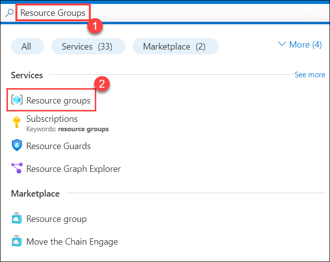

2. On the Resource groups page, **search for analyticsSolution (1)** in the filtering option and select **analyticsSolution (2)**.

    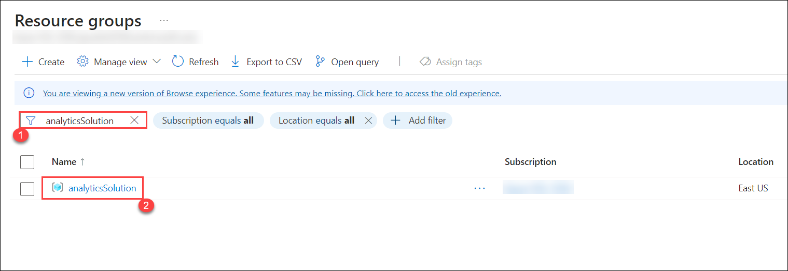

3. In the Resources filter box, search for **app (1)**. From the filtered results, select the **app-realtime-kpi-analytics-<inject key="DeploymentId"></inject> (2)** App Service.

    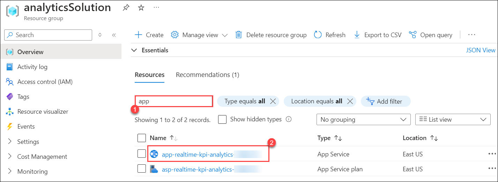

4. Click **Browse** located at the top left corner. This will initiate the data simulation necessary for the successful execution of this task.

    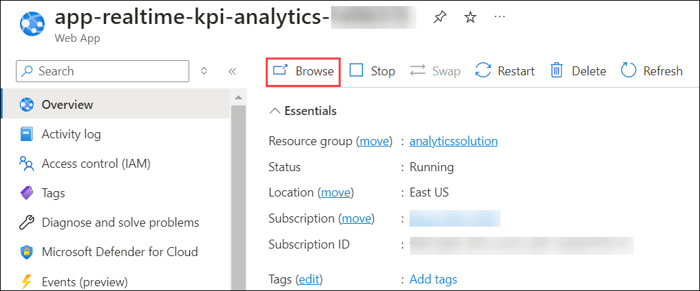

    > **Note :** A new browser tab will open.
    
5. Upon clicking **Browse**, you will be directed to a webpage confirming that **Data Simulation** has Started. You can close the browser. This process will take approximately 3-5 minutes to complete. In the meantime, you can continue with the next steps.

    

6. Return to the Azure Portal session and select the **analyticsSolution** resource group from the top navigation bar.

    

7. On the Resource groups page, **search for Synapse (1)** in the filtering option and select **synapse<inject key="DeploymentId"></inject> (2)**.

    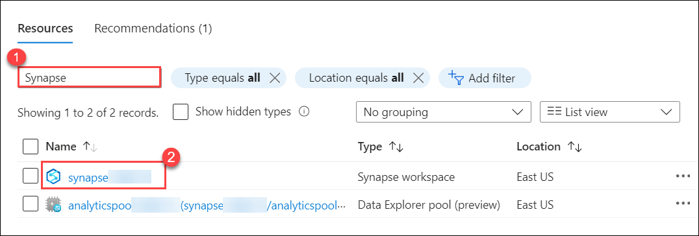

    >**Note:** You might see a Synapse workspace resource name with a different suffix in your Azure Portal.

8. Click on the **Open (2)** link within the **Synapse Studio tile (1)**.

    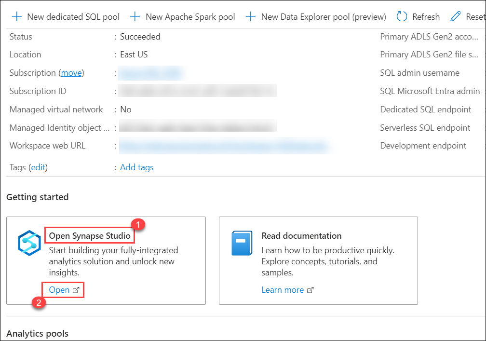

    >**Note:** Synapse Studio opens in a new web session (tab).

9. Since you are already signed in as <inject key="AzureAdUserEmail"></inject>, you will be automatically logged in to Synapse Studio when you access the portal.

10.	In Synapse Studio, on the left pane, select the **Data** hub icon.

    
    
11. In the **Data** pane, expand **Data Explorer Databases (Preview) (1)**, then expand the **analyticspool<inject key="DeploymentId"></inject> (3)** Data Explorer pool. Select the **ellipses (4)** (the three dots next to the data explorer pool).

    >**Note:** If you do not see the ellipses, expand the Data pane by dragging it to the right. 

    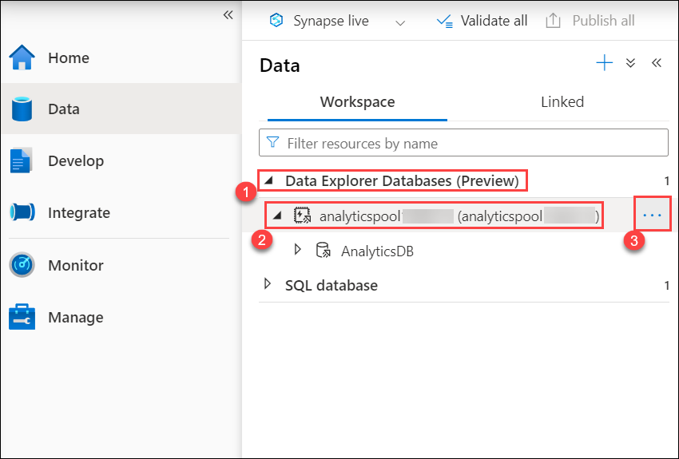

12. Select **Open in Azure Data Explorer**.

    *This will open Azure Data Explorer in a new web session (tab).*

    

13. Since you are already signed in as <inject key="AzureAdUserEmail"></inject>, you will be automatically logged in to Azure Data Explorer when you access the portal.
    
14. For this lab, there's already an ADX pool set up in the Azure Synapse workspace. With ADX's Kusto Query Language (KQL), you can check if the thresholds you've defined for each device in the store are being met.

    Remember, KQL is also used in other Azure services for analytical queries, like Azure Monitor logs, Application Insights, and Microsoft Defender for Endpoint.

    > **Note:** If any pop-up appears on your screen, just click **Trust** to close it.

    .png)

15. In Azure Data Explorer Studio, in the left pane, select the **Home (1)** hub icon and Choose the **Table (2)** action in the Create new tile.

     

16. Press the **Cancel** button to navigate to the **Data Management** page.

     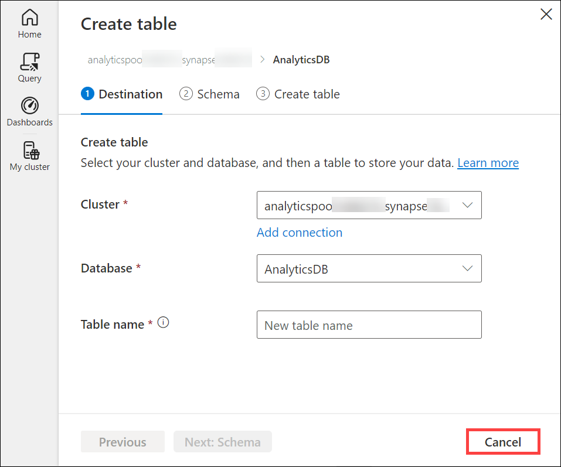

17. On the **Data Management** page, click on the **Ingest data** action.

    

18. On the **Ingest Data** page, input or choose the following details:

    - Cluster: **analyticspool<inject key="DeploymentId"></inject> (1)**

    - Database: **AnalyticsDB (2)**

    - Table: Click on the **New table (3)** button and type in **Thermostat (4)**.

    - Click on **Next: Source (5)**.

    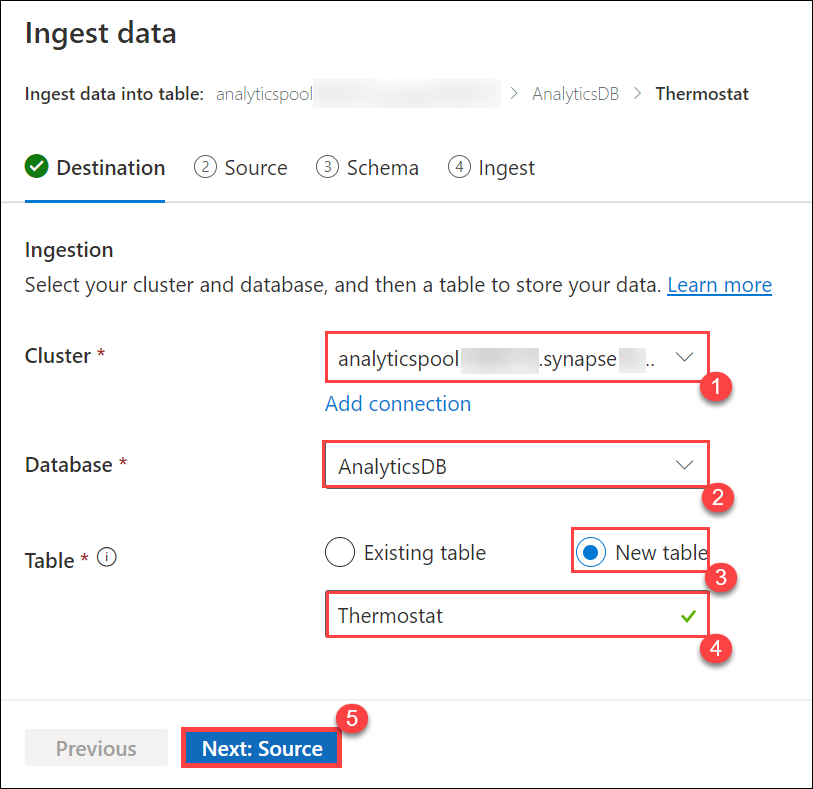

19. On the **Destination** page, input or choose the following details:

    - Source type: **Event Hubs (1)**

    - Choose the default **Subscription (2)**.

    - Event Hub namespace: **adx-thermostat-occupancy-<inject key="DeploymentId"></inject> (3)**

    - Event Hubs: **thermostat (4)**

    - Data connection name: **AnalyticsDB-thermostat (5)**

    - Consumer group: **$Default (6)**

    - Click on **Next: Schema (7)**.

     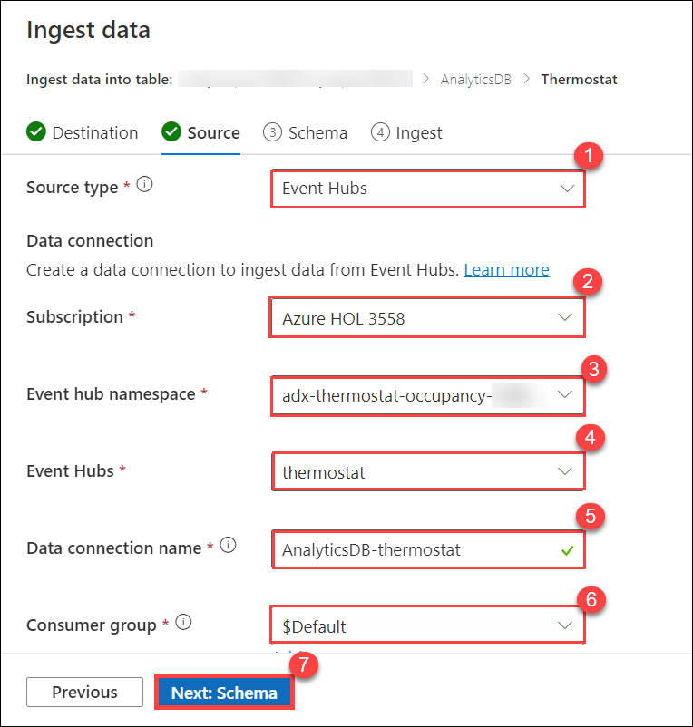

20.	In the **Schema (1)** tab, please wait until the data preview loads, which typically takes about 20 seconds. Once loaded, review the **event data (2)**, which consists of thermostat measures from various devices. In the **Data format** dropdown list, select **JSON (3)**. Click on **Next: Start ingestion (4)**.

    

21. Ensure that the continuous ingestion from the Event Hub has been successfully established, and then click on **Close** located at the bottom of the page.

     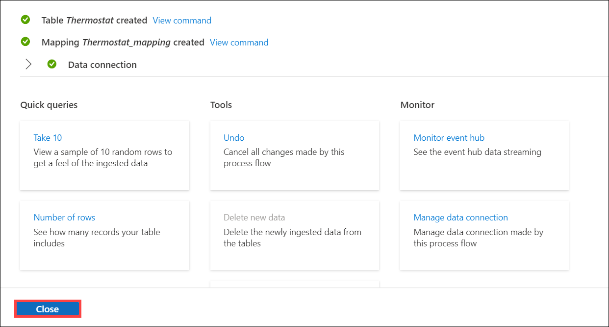

22.  Go back to the **Synapse Studio web session (tab)**.

23. In Synapse Studio, on the left-hand side, click on the **Develop (1)** hub icon (the third icon from the top), expand **KQL scripts (2)** and Choose the **ThermostatOccupancyScript (3)** script.

     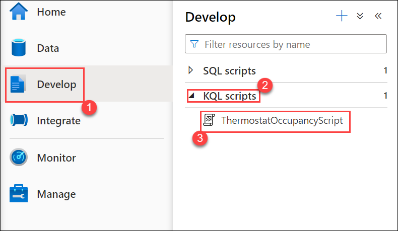

24. From the **Connect to (1)** dropdown list, choose the data explorer pool beginning with **analyticspool-<inject key="DeploymentId"></inject>**.In the **Use database (2)** dropdown list, select **AnalyticsDB**.
    
    > **Note:** If you don't find this option, click on the ellipsis [...] next to Publish on the top bar.

    > **Note:** Collapse the panes on the left, if needed, by clicking on the << icon at the top right of each pane.

      

25. Choose the query (lines 4-8) labeled as **What is the average temp every minute?**. Click on **Run**. 

    *This query retrieves the average temperature per minute for a thermostat device (TH005) in the Miami store.*

      

26. In the **Results** pane at the bottom, examine the query result displayed as a chart. Please be patient as it may take up to 2-3 minutes to accumulate data. If you don't see any result, try re-running the query after some time.

      

    >**Note:** If you encounter no data in the query result, wait for a few minutes and try again as the data takes some time to start streaming. If your query returns an error, it's possible that the thermostat table wasn't created successfully in previous steps. You might need to create the table with a different name (e.g., Thermostat1), update the KQL query accordingly, and rerun the query.  

    *Your graph might differ slightly from the one shown above. It may take up to 60 seconds to load.*

27.	Notice that the temperature in the Miami store fluctuates between 65 and 70 degrees Fahrenheit. With these insights, we can adjust the temperatures to optimal levels.

### Task 2: Explore a few Synapse pipelines that ingest raw data from analytical data sources to the Bronze layer of the Data Lake. 
  
In this task, you will be ingesting campaign data from Snowflake and customer churn data from Teradata into the data lake.

1. Go back to the **Synapse Studio web session (tab)**.

1. In Synapse Studio, on the left-hand side, select the **Integrate (1)** hub icon (the fourth icon from the top). In the **Integrate** pane, expand **Pipelines (2)**. Expand the **1 Enterprise Data Sources In The Lake (3)** folder. Expand the **Landing Analytical Store Data (4)** folder. Select the **Campaigns Data from Snowflake (5)** pipeline.

    >**Note:** If required, collapse the panes on the left by clicking the << icon at the top right of each pane.

    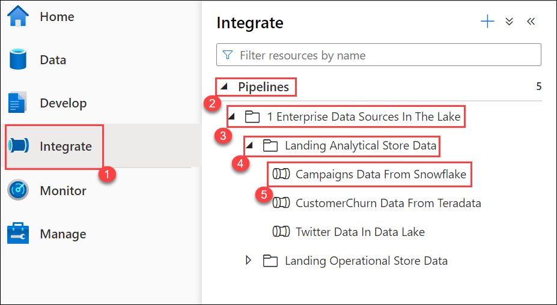

    *The ***Campaigns Data from Snowflake*** pipeline has two activities. The first one runs a lookup of data at the source Snowflake connection. The next activity brings that data into the Bronze layer in ADLS Gen2.*

1. In the pipeline designer, click on the **Lookup (1)** activity. In the pane below, navigate to the **Settings (2)** tab. Notice that **SnowflakeTable (3)** is selected in the **Source dataset** dropdown list.

    

1. Click on the **Copy data (1)** activity in the pipeline designer. In the pane below, go to the **Sink (2)** tab. Observe that **SnowflakeCampaignsData (3)** is selected in the **Sink dataset** dropdown list.

   
   
    *Similarly, the next pipeline is designed to ingest customer churn data from Teradata, and Twitter data into the data lake.*

    >**Note:** The image is for informational purposes only. Due to time constraints, we will not explore it in the lab.
   
    
### Task 3: Explore a few Synapse pipelines that ingest raw data from operational data sources to the Bronze layer of the Data Lake. 

In this task, you will explore the design of a Synapse pipeline. This pipeline is designed to ingest raw data from various operational sources into the data lake.

1. Navigate to the **Integrate** pane, expand the **Landing Operational Store Data (1)** folder, and select the **Store Transactions Data from SQL DB (2)** pipeline.

   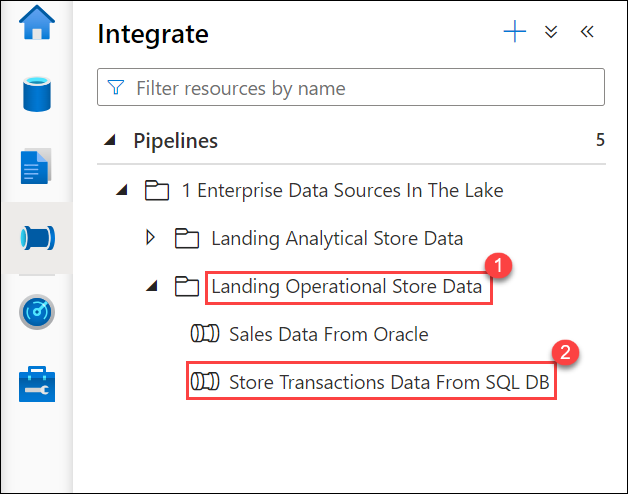

    *The **Store Transactions Data from SQL DB** pipeline comprises two activities. The first activity performs a lookup of data at the source Azure SQL Database connection. The subsequent activity brings that data into the Bronze layer in ADLS Gen2*.

    >**Note:** If required, collapse the panes on the left using the << icon at the top right of each pane.

2. Within the pipeline designer, click on the **Copy data (1)** activity. In the pane below, go to the **Sink (2)** tab. Observe that **DestinationDataset (3)** is selected in the **Sink dataset** dropdown list.

    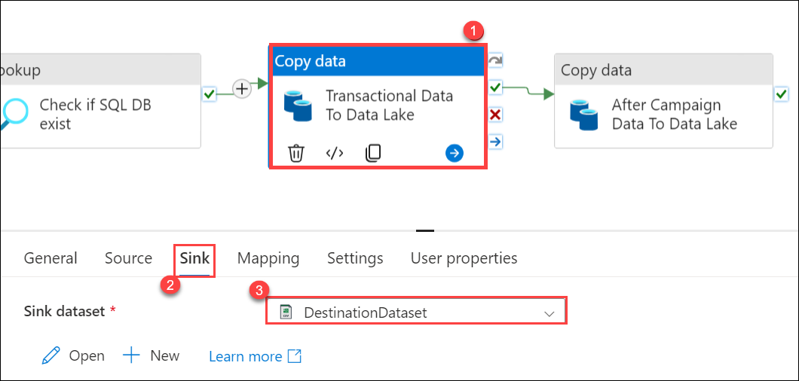

3. Similarly, the next pipeline **Sales Data from Oracle (2)** under **Landing Operational Store Data (1)** is designed to ingest Sales data from Oracle into the data lake.

    >**Note:** The image is for informational purposes only. Due to time constraints, we will not explore it in the lab..

    

### Congratulations! 
### As a data engineer, you have successfully ingested streaming near real-time and historical data into the data lake for Wide World importers.
