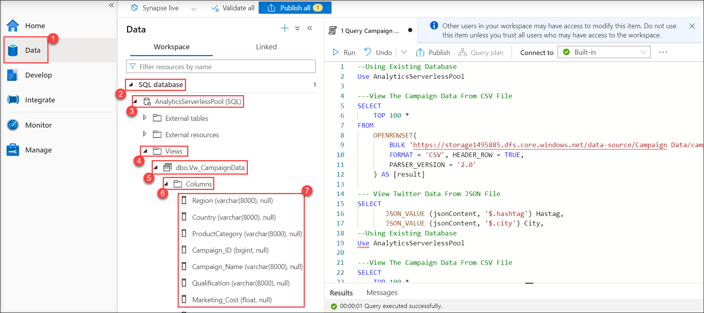

## Exercise 1: Explore Machine Learning and Business Intelligence scenarios on the Lakehouse. 

### Task 1: Review MLOps pipeline using the Azure Databricks managed MLflow and Operationalized as an ML service in Azure ML

Now that we've ingested and processed our customer data, we want to understand what makes one customer more likely to churn than another, and ultimately see if we can produce a machine learning model that can accurately predict if a particular customer will churn.

We would also like to understand our customer's sentiments so we can create targeted campaigns to improve our sales.

*Architecture Diagram*

1. In the Azure portal, type **Azure Databricks (1)** in the search box, click enter, and select **Azure Databricks (2)** from the results.

 
     
   
2 On the **Azure Databricks** page, select **databricks<inject key="DeploymentId"></inject>**.

   
   
3. In the Azure Databricks resource page, select **Launch Workspace**.

   

   *A new web session (tab) will open. Now, set up the Databricks compute ready to serve your workload.*

   >**Note:** If a pop-up appears, select **Close**.

4. On the search bar of the Databricks web session type **Workspace (1)** and then select the **ML Solutions in OneBox (2)** notebook. 

    

5. Once the notebook is open, click on the **table of contents (1)** icon to expand the contents.

     

   In this task, you won’t run any cells. Instead, you will explore the selected cells and review their outcomes.
   In the scatter-plot chart below, you can see the correlation between:

   - Customer churn,
   - Amount spent by the customer, and
   - Number of months as a customer (tenure).

   Here you will find that most of the customers who churn are those who spend the least amount of money and have been customers for fewer months.

6. In the notebook, Scroll down to review the **cmd 11 (1)** cell and then review the output for **Exploratory Data Analysis**.

     

**Operationalized as an ML service using MLOps in Azure ML/AI**.

7. Review the **cmd 44** cell to load Azure ML Workspace.

    

   The MLflow plugin **azureml-mlflow** is used to deploy the Customer Churn ML model to Azure ML. The deployed ML model will be used to predict Customer Churn.

**Twitter Sentiment Score Custom ML Model**

*This model helps Wide World Importers analyze the sentiment of their customers based on what's trending on social media platforms like Twitter. Popular social media sentiments can then be used to create effective marketing campaigns for the target audience.*

8. On the left, select the small arrow to expand the sidebar. Collapse the Customer Churn Model section and then select **Twitter Sentiment Score Model (2)** from the **table of contents (1)**.

   
   
9. Review the **cmd 75** cell for training and validation of customer sentiment model.

     *Here the Twitter sentiment model is trained for further consumption.*
      

**Campaign Analytics**

10. From the sidebar, select **Campaign Analytics**.

    

11. Review the **cmd 88** cell.

    *Wide World Importers decided to run a number of campaigns using the Twitter sentiment model, which was trained in the cmd 75 cell, to reduce customer churn and increase revenue.*

    

**Sales Forecasting**

12. From the sidebar, scroll down and select **Sales Forecasting**.

    

    A sales forecasting model was used by Wide World Importers to validate if their approach to reduce churn and improve sales was effective.

    *Here you are forecasting sales using a Regression model and deploying it to Azure ML as a service using a model registered in Azure Databricks.*

13. Review the **cmd 127** cell where model deployment is created.

    

    *The model is deployed to an Azure ML endpoint from which it can be consumed to predict sales.*

14. Review the **cmd 133** cell to see sales forecast using store data after launching the campaigns.

    

*All these analysis using MLOps helped Wide World Importers predict a positive sales forecast and a successful year ahead*.

### Task 2: Leverage Power BI to derive actionable insights from data in the Lakehouse. 

For this task, the date is November 1. Wide World Importers now needs to prepare for a successful Cyber Monday Sale event. Good news! The enriched datasets sourced from disparate data sources and the best-performing model outputs have now been placed in the Lakehouse for Power BI consumption.

In this task, you will work with Power BI to reveal some valuable insights.

> **Note:** Please make sure you are **logged into the VM** for the following steps.

1. Open a new web session (tab) in the VM, and then enter: **https://powerbi.com**.

   > **Note:** Dismiss any popups that appear on your screen.

2. On the left panel, select **workspaces (1)**, and then select **My Workspace (2)**.

    

3. To upload a Power BI Desktop file, click on **Upload (1)** and in the dropdown menu, select **Browse (2)**.

   > **Note:** Please make sure you are **logged into the VM** for the following steps.

    

4.	In the **Open** window, navigate to the **C:\LabFiles\artifacts\reports (1)** folder, select the **AnalyticsDemoReport.pbix (2)** file and **Open (3)** It.

    

5.	Notice that a Power BI report and dataset have been added to your workspace.

    

6. To open the report, select the **AnalyticsDemoReport**.

   

   > **Note:** If needed, collapse the panes on the left using the << icons on the top right of the pane. This will maximize the screen and provide a better visual.

   > **Note:** You can zoom or magnify the report by using the option given in the bottom, you can also open a tile in a full screen view by clicking on the focus mode icon.

   

7. This report has three sections:

   - Churn Analysis
   - Campaign Analytics
   - Website Analytics

   

8. Lets navigate to the **Churn Analysis Tab,** where we analyze Customer Churn. This report, along with Campaign Analytics and Website Analytics reports in Power BI, are coming from the data Lakehouse.

    

9. In the Scatter Chart on the left, the black dots represent customers more likely to churn, and the blue dots represent customers less likely to churn. Notice that when customer tenure is low and their spend amount is low, the customers are more likely to churn.
With this insight, Wide World Importers decides to target customers with lesser tenure and lesser spend amounts through their new campaigns.

    

    Now, let's go the Campaign Analytics. 

10. Select the **Campaign Analytics** tab from the top right pane to navigate to the Campaign Analytics report.

    

11. In this Campaign Analytics report, the Bar chart shows that the most popular campaigns launched are **gogreen** and **sustainablefashion**. 

    

12 Select **Website Analytics** from the top right pane to navigate to the Website Analytics Report.
         
   

13. Website Analytics Report, we see an immediate problem for Wide World Importers. The bounce rate is high (1). It looks like a large population of their customers/visitors leave their website without much activity. As per this Donut/ pie chart (2), it seems that the bounce rate is high because around 57 % of the online customers are not happy. 

      
13. Click on **Not Happy** on the Donut chart to filter the report page.

    
  
    The **site visitors by age group** chart shows that most of the "Not Happy" customers are in the age group 31 to 40. It seems that millennials make up the majority of unhappy online customers. Now, let's see what these millenials typically shop for online.
 
    

    *Hover over the bars to see the visuals of the products bought by the repeat customers.*

17.  We know that the millenials from the biggest customer segment are "Not Happy" when...

- they do not find the product they searched for on the website.
- they were redirected to Wide World Importers website from a third party website.
- the website user experience on their mobile phones is not good.
- they are not able to find discounts on the website.

   

    As a result, we can see that we need to improve the user experience on the website for product search and make sure that it renders correctly on mobile phones.
  
    Now, let's navigate to the key influencers. 

18. Select **Top Segments** to show the details.

    

19. Click on the first bubble and see the details for Segment 1.

    

    *Segment 1 shows that it comprises of 94.5% customers who are not happy. It also shows that 94.5 % of the "Not Happy" customers experienced failed product searches. These are the millennials who are using their mobile devices for shopping.*

    
 
As a result of this analysis, Wide World Importers reduced their bounce rate by implementing a mobile-friendly website with fast product searches, focusing on high demand products for millenials.
These changes not only improve the bounce rate dramatically, but they also reward Wide World Importers with uprecedented sales at their Cyber Monday Sale event. 

Let's see how, on an ongoing basis, if there are any business needs to run adhoc time-critical queries, it can be achieved via custom queries. 

We will discuss that in more detail in the next task.

### Task 3: Explore SQL Analytics with Azure Synapse Serverless. 

Data engineers are often required to support ad hoc and time-critical queries in addition to regular scheduled reports.

In this task, you will learn how to perform custom SQL and business intelligence workloads on the data lake. You will query the data lake by using Azure Synapse Analytics. Specifically, you will rely upon Azure Synapse serverless SQL pools, which is a service that queries data in a data lake. It’s important to understand that the data can be queried without the need to move it into tables.

1. In the search box (located across the top of the page) on the Azure portal web session (tab), enter: **Synapse Analytics** and select **Azure Synapse Analytics** in the search results pane.

   

2. Select the Azure Synapse resource.

    

3. In the **Open Synapse Studio** tile, select the **Open** link.

   

   *Synapse Studio opens in a new web session (tab).*

4. In Synapse Studio, on the left, select the **Develop** hub icon (the third from the top).

    
   
   *In Synapse Studio, you can use T-SQL to directly query data in a data lake by using a serverless SQL pool. That way, you can achieve rapid data exploration.*

5. In the **Develop** pane, expand **SQL scripts (1)** and select the **1 Query Campaign And Twitter Data Using T-SQL Language (2)** script.

    
   
   *You can directly query external files stored in ADLS Gen2 storage without first copying or loading the data into a specialized store. You can query the data by using the familiar T-SQL syntax.*

6. In the **Connect to** dropdown list, ensure that **Built-in (1)** is selected. In the **Use database** dropdown list, ensure that **AnalyticsServerlessPool (2)** is selected.

    
   
   *You will use the built-in endpoint for this service that’s provided within every Azure Synapse workspace. It’s a Synapse serverless SQL pool.*

   > **Note:** Collapse the panes on the left by selecting the << icon on the top right of the panes.

7. To query the first 100 campaigns, in the script file, **select lines 5-12 (1)** ,Select **Run (2)**, and review the **query result (3)** in the lower pane.

    
   
    We can also directly query external files stored in Azure storage without copying or loading data into a specialized store, all using familiar T-SQL dialect. This is a quick and easy way to read the content of the files without pre-configuration.

    A default, built-in, endpoint for this service is provided within Synapse workspace.

    *You will now create a view of the campaign file.*

8. To create a view that queries the first 100 campaigns, **select lines 57-66 (1)** in the script file and select **Run (2)** to create a view of the Campaign file in Serverless pool.

    

    With the relevant metadata placed in an Azure storage account, the views will allow us to reuse those queries in other places as well such as Power BI, in conjunction with serverless SQL pool.

    *Executing ad hoc queries and creating views over data in the data lake by using a Synapse serverless SQL pool is straightforward*.

    To verify the view that just got created.

9. From the left pane, select **Data (1)**, then expand **AnalyticsServerlessPool (SQL) (3)** under SQL **Database (2)**. Next, expand **Views (4)**, followed by **dbo.Vw_CampaignData (5)**, and finally, expand **Columns (6)** to review the **available columns (7)**.

    
 
We can do the same even with Databricks. Let us see how.

### Task 4: Explore SQL Analytics with Azure Databricks. 

Azure Databricks provides an environment that allows you to run quick ad hoc SQL queries on your data lake. Queries support multiple visualization types that help you explore query results from different perspectives.

In this task, you will explore some SQL analytics features of Azure Databricks, including export, import, and running a workbook.

1. In the Azure portal, type **Azure Databricks (1)** in the search box, click enter, and select **Azure Databricks (2)** from the results.

    

2. In the **Azure Databricks** page, select the resource that has a name starting with **databricks**.

   *Note: Each student has their own unique instance of this resource. Each Azure Databricks workspace is provisioned with a full-featured development environment.*

    

3. In the Azure Databricks resource page, select **Launch Workspace**.

   

   *A new web session (tab) opens.*

   *You will now export a Databricks notebook in HTML format to your local machine.*

4. In the Databricks web session (tab), type **Notebooks (1)** in the search bar and click enter. Select **04_SQL_Analytics_On_Delta_Live_Tables (2)** notebook in Databricks workspace.

    
   
5. Review cmd 7 cell.

   **Raw Twitter Data - Bronze**

   *The bronze layer stores the raw, unprocessed data from Twitter API pulls. By leaving it in its raw state, there's an option to reprocess it for different purposes in the future. Thanks to Azure Data Lake Gen2, it is possible to maintain this data for as long as possible at a very low cost.*
   *The bronze layer is usually the domain of data engineers who build pipelines to refine this data and forward it into the Silver layer.*

   

6. Review cmd 7 cell.

   **Filtered Twitter Data - Silver**

   *In the Silver layer, the raw Twitter data is curated into something more usable for data scientists.*
   *They can take up this cleaned up data products and develop features for machine learning models as well as aggregated analytical datasets for data analysts*.

   

7. Review cmd 9 cell.

   **Curated Twitter Data - Gold**

   *The Gold layer is to enhance and refine the silver layer datasets even further so that it is ready for fit-for-purpose tables and views for specific analytical needs.*
   *Here we've augmented the Twitter data with a machine learning model to identify the sentiment (positive, neutral, or negative) of each tweet.*

   

8. Review cmd 11 cell.

    **Aggregations Are A Great User Experience Enhancement**

    *By pre-emptively aggregating the data that rarely or slowly changes, it provides a great performance benefit to the end users.*
    *The DLT pipeline performs this aggregation of hashtag counts by the geolocation of the tweets.*
    By updating this everytime more tweets are ingested, it is possible to keep the aggregation table up-to-date and then quickly consume and visualize it in tools like Power BI.One nice feature of Databricks notebooks is, if a cell produces a DataFrame output (like the one below), you can also profile the data as well as generate quick visualizations. Throw in Markdown and comments, and notebooks are a super convenient way to collaborate and communicate with your team, leadership, customers, and other stakeholders.

    

9. Review cmd 20 cell.

   **Z-Order Optimization**

   *Z-Ordering is a technique to co-locate related information in the same set of files.*
   *This co-locality is automatically used by Delta Lake on Databricks data-skipping algorithms.*
   *This behavior dramatically reduces the amount of data that Delta Lake on Databricks needs to read.*

   

10. Review cmd 22 cell.

   **Caching**

   *Caching reduces scanning of the original files in future queries. It caches contents of a table in Apache Spark cache. If a query is cached, then a temperoray view is created for this query.*

   

11. Review cmd 24 cell.

    **Time Travel**

    *In the audit history it is possible to see the history of the different versions of the table as well as load and display any of those versions.*

    

12. Finally, Explored Machine Learning and Business Intelligence scenarios on the Lakehouse.

**Congratulations!!!**
**You have completed Explore Machine Learning and Business Intelligence scenarios on the Lakehouse Lab.**

