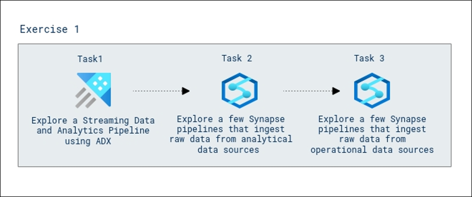
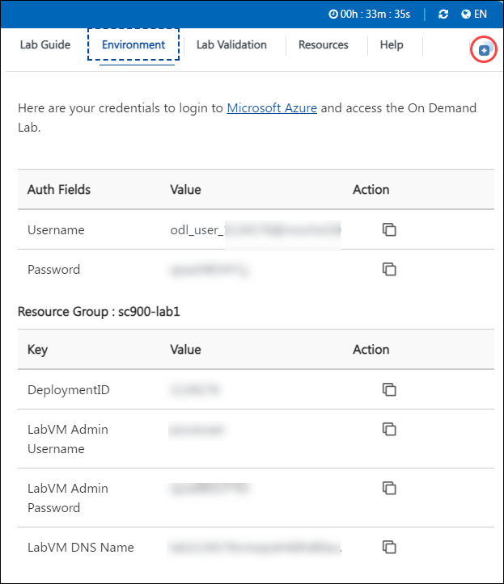

# Analytics in Microsoft Intelligent Data Platform (MIDP)

### Overall Estimated Duration : **90 Minutes**

## Overview

In this hands-on lab, you will explore data ingestion techniques to build a robust Lakehouse architecture using Azure Synapse Analytics, Azure Data Explorer (ADX), and supporting tools. This lab focuses on ingesting data from a wide array of analytical and operational data sources, including streaming near real-time data and historical datasets, into a unified Lakehouse. By leveraging the capabilities of Azure Synapse pipelines, Azure Event Hub, and ADX, you will gain hands-on experience in setting up data ingestion workflows, performing real-time analytics, and preparing data for downstream analytics and machine learning workloads.

## Objective

**Data ingestion from a spectrum of analytical and operational data sources into the Lakehouse**: Learn to design and configure Synapse pipelines to ingest both near real-time IoT streaming data and historical data from a variety of analytical and operational sources into the Lakehouse. Gain hands-on experience in setting up real-time ingestion using Azure Event Hub and Azure Data Explorer (ADX) for streaming data, and explore how to efficiently ingest analytical data from Snowflake and Teradata, as well as operational data from Azure SQL Database and Oracle. This process will develop the skills needed to handle both streaming and batch data ingestion, ensuring seamless integration into a unified Lakehouse architecture for advanced analytics and insights.

## Prerequisites

Participants should have:

- **Basic Knowledge of Microsoft Azure:** Familiarity with the Azure portal, Azure Synapse Analytics, and Azure Data Explorer (ADX).
- **Understanding of Data Ingestion Pipelines:** Awareness of data ingestion workflows and pipeline structures in Azure Synapse.
- **Basic Knowledge of Kusto Query Language (KQL):** Fundamental understanding of KQL for querying and analyzing data in Azure Data Explorer.
- **Familiarity with Event Hub:** Basic knowledge of Azure Event Hub for ingesting streaming data.
- **Experience with Data Lake Storage:** Understanding the role of Azure Data Lake Storage in data ingestion and storage workflows.

## Architecture

The architecture for this lab involves ingesting both near real-time streaming data and batch data from various operational and analytical sources into a centralized data lake. **Azure Data Explorer (ADX)** is used to analyze the streaming data in near real-time, particularly for monitoring thermostat data. The **Azure Synapse Analytics** service is utilized for ingesting and processing batch data from sources like **Snowflake**, **Teradata**, **SQL DB**, and **Oracle** into the Bronze layer of the **Azure Data Lake Storage**. This data lake serves as the foundation for further analytics and business intelligence.

## Architecture Diagram

## Explanation of Components

The architecture for this lab involves the following key components:

- **Azure Data Explorer (ADX):** Used for ingesting and analyzing near real-time data, such as thermostat readings, from Event Hubs. ADX is used to monitor and manage data, helping with immediate insights and operational efficiency.
- **Azure Synapse Analytics:** A fully integrated analytics platform that combines big data and data warehousing. It is used to create pipelines that ingest batch data from various data sources (Snowflake, Teradata, SQL DB, Oracle) into the Bronze layer of the data lake.
- **Azure Data Lake Storage:** The central data storage system where raw data from both real-time and batch processes is ingested. This data serves as the foundation for further analytics, reporting, and machine learning models.
- **Azure Event Hub:** Manages the ingestion of streaming data from devices, like thermostats, into ADX for real-time analysis. This is key for the ingestion of continuous data streams.
- **Synapse Pipelines:** These pipelines manage the orchestration of data movement from various operational and analytical sources into the data lake, providing a structured flow of raw data into the system. 

## Getting Started with the Lab 

Once you're ready to dive in, your virtual machine and lab guide will be right at your fingertips within your web browser. 

> **Note:** We recommend having strong internet connectivity while performing the lab. Please ensure you are not connected to a VPN, which can slow down the lab-user experience.

>**Note:** Please minimize the PowerShell window when it appears, do not close it, and wait 15 minutes for the process to complete.
## Virtual Machine & Lab Guide

In the integrated environment, the lab VM serves as the designated workspace, while the lab guide is accessible on the right side of the screen.

**Note**: Kindly ensure that you are following the instructions carefully to ensure the lab runs smoothly and provides an optimal user experience.

## Exploring Your Lab Resources

To receive lab environment details, select the **Environment Details** tab. Additionally, the credentials will be sent to the email address you provided at registration.

   **Note:** If you see the pop-up **experience.cloudlabs.ai would like to access the Clipboard to copy text**, please click on **Allow**.

   
## Utilizing the Split Window Feature
 
For convenience, you can open the lab guide in a separate window by selecting the **Split Window** button from the Top right corner.
 
 

## Lab Guide Zoom In/Zoom Out
 
To adjust the zoom level for the environment page, click the **A↕ : 100%** icon located next to the timer in the lab environment. 

  

## Managing Your Virtual Machine

Feel free to start, stop, or restart your virtual machine as needed from the **Resources** tab. Your experience is in your hands!

  
  
## Let's Get Started with Azure Portal

1. On your virtual machine, click on the Azure Portal icon as shown below:

   
   
1. You'll see the **Sign into Microsoft Azure** tab. Here, enter your credentials:
 
   - **Email/Username:** <inject key="AzureAdUserEmail"></inject>
 
       
 
1. Next, provide your password:
 
   - **Password:** <inject key="AzureAdUserPassword"></inject>
 
       

1. If you see the pop-up **Action Required**, keep default and then click on **Ask later**. If you see the pop-up **Help us protect your account**, click on **Skip for now(14 days until this is required)**, and then click on **Next**.

   >**Note:** You may see this pop-up multiple times, please proceed to **Skip**.

   
 
1. If prompted to stay signed in, you can click "No."

1. If you see the pop-up **Sign in to sync data**, Click on **No,thanks.** 

1. If you see the pop-up **You have free Azure Advisor recommendations!**, close the window to continue the lab.

1. If a **Welcome to Microsoft Azure** popup window appears, click **Cancel** to skip the tour.

1. In the Azure portal, type **Resource groups (1)** in the search box and select **Resource groups (2)** from the results.

    

13. On the **Resource groups** page, select **analyticsSolution**.

    

## Support Contact
 
The CloudLabs support team is available 24/7, 365 days a year, via email and live chat to ensure seamless assistance at any time. We offer dedicated support channels tailored specifically for both learners and instructors, ensuring that all your needs are promptly and efficiently addressed.

Learner Support Contacts:
- Email Support: cloudlabs-support@spektrasystems.com
- Live Chat Support: https://cloudlabs.ai/labs-support

Now, click on **Next** from the lower right corner to move on to the next page. 

### Happy Learning!!
