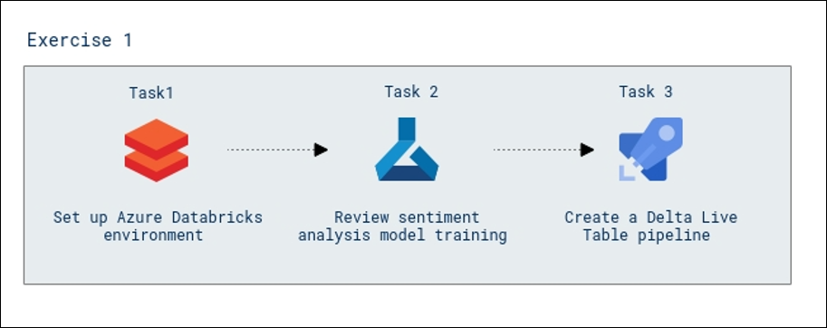

# Analytics in Microsoft Intelligent Data Platform (MIDP)

### Overall Estimated Duration : **90 Minutes**

## Overview
 
Azure Databricks, combined with Delta Live Tables, enables seamless data processing, analysis, and machine learning within a unified Lakehouse architecture. In this hands-on lab, you will set up an Azure Databricks environment, explore a sentiment analysis model, and create a Delta Live Table pipeline to process and analyze data from multiple sources.  

This lab demonstrates how to integrate campaign data, customer churn data, and Twitter messages into a single Lakehouse structure, enabling Wide World Importers to gain actionable insights and improve data-driven decision-making.

## Objective

**Explore the offline data and analytics pipeline using open Delta format and Azure Databricks Delta Live Tables. Stitch streaming and non-streaming data landed earlier to create a combined data product to build a simple Lakehouse:** Learn to set up and manage an **Azure Databricks environment**, configure **Delta Live Table (DLT) pipelines**, and integrate machine learning models for sentiment analysis. Gain hands-on experience in exploring datasets from multiple sources, including **campaign data**, **customer churn data**, and **Twitter messages**, and processing them into a unified **Lakehouse architecture**. This lab focuses on building a reliable data pipeline using **Delta Live Tables** to ensure efficient ETL operations, maintain data quality, and enable seamless data lineage tracking across **Bronze**, **Silver**, and **Gold** layers. By completing this lab, you’ll develop essential skills for managing data workflows, deriving actionable insights, and supporting advanced analytics and machine learning scenarios.

## Prerequisites

Participants should have:  

- **Basic Knowledge of Microsoft Azure:** Familiarity with the Azure portal and core Azure services such as Azure Databricks and Azure Data Lake Storage Gen2.  
- **Understanding of Data Pipelines:** Awareness of data ingestion and transformation workflows using ETL/ELT processes.  
- **Familiarity with Delta Lake Concepts:** Basic knowledge of Delta Lake architecture, including Bronze, Silver, and Gold layers.  
- **Experience with Notebooks in Databricks:** Understanding how to navigate and execute notebooks in Azure Databricks.  
- **Basic Understanding of Machine Learning Models:** Awareness of how machine learning models are trained and deployed for data analysis tasks. 

## Architecture  

The lab architecture follows a structured flow designed to build an integrated **Lakehouse** using **Azure Databricks Delta Live Tables (DLT)**. The process begins with setting up the **Azure Databricks Environment**, ensuring the infrastructure is ready for data processing and analysis tasks. Next, a **Sentiment Analysis Machine Learning Model** is reviewed and integrated, enabling advanced analytics on Twitter data. Finally, a **Delta Live Table Pipeline** is created to stitch together streaming and non-streaming data from various sources, transforming it through **Bronze**, **Silver**, and **Gold** layers. This architecture ensures seamless data ingestion, transformation, and preparation for downstream analytics and machine learning workflows.  

## Architecture Diagram

  

## Explanation of Components  

The architecture for this lab involves the following key components:  

- **Azure Databricks Environment:** The foundational setup for creating, managing, and running data engineering and machine learning workloads. This environment provides a collaborative workspace for teams to build and execute notebooks.  

- **Sentiment Analysis Model:** A pre-trained **Machine Learning Model** used to analyze Twitter data, identifying sentiment as positive, negative, or neutral. The model outputs are integrated into the Delta Live Table pipeline for further analysis.  

- **Delta Live Table Pipeline (DLT):** A managed ETL pipeline framework in Azure Databricks that automates data ingestion, transformation, and quality enforcement. DLT simplifies data workflows and ensures data integrity across **Bronze**, **Silver**, and **Gold** layers.  

## Getting Started with the Lab 

Once you're ready to dive in, your virtual machine and lab guide will be right at your fingertips within your web browser. 

> **Note:** We recommend having strong internet connectivity while performing the lab. Please ensure you are not connected to a VPN, which can slow down the lab-user experience.

>**Note:** Please minimize the PowerShell window when it appears, do not close it, and wait 15 minutes for the process to complete.
## Virtual Machine & Lab Guide

In the integrated environment, the lab VM serves as the designated workspace, while the lab guide is accessible on the right side of the screen.

**Note**: Kindly ensure that you are following the instructions carefully to ensure the lab runs smoothly and provides an optimal user experience.

## Exploring Your Lab Resources

To receive lab environment details, select the **Environment Details** tab. Additionally, the credentials will be sent to the email address you provided at registration.

   **Note:** If you see the pop-up **experience.cloudlabs.ai would like to access the Clipboard to copy text**, please click on **Allow**.

   
## Utilizing the Split Window Feature
 
For convenience, you can open the lab guide in a separate window by selecting the **Split Window** button from the Top right corner.
 
 

## Lab Guide Zoom In/Zoom Out
 
To adjust the zoom level for the environment page, click the **A↕ : 100%** icon located next to the timer in the lab environment. 

  

## Managing Your Virtual Machine

Feel free to start, stop, or restart your virtual machine as needed from the **Resources** tab. Your experience is in your hands!

  
  
## Let's Get Started with Azure Portal

1. On your virtual machine, click on the Azure Portal icon as shown below:

   
   
1. You'll see the **Sign into Microsoft Azure** tab. Here, enter your credentials:
 
   - **Email/Username:** <inject key="AzureAdUserEmail"></inject>
 
       
 
1. Next, provide your password:
 
   - **Password:** <inject key="AzureAdUserPassword"></inject>
 
       

1. If you see the pop-up **Action Required**, keep default and then click on **Ask later**. If you see the pop-up **Help us protect your account**, click on **Skip for now(14 days until this is required)**, and then click on **Next**.

   >**Note:** You may see this pop-up multiple times, please proceed to **Skip**.

   
 
1. If prompted to stay signed in, you can click "No."

1. If you see the pop-up **Sign in to sync data**, Click on **No,thanks.** 

1. If you see the pop-up **You have free Azure Advisor recommendations!**, close the window to continue the lab.

1. If a **Welcome to Microsoft Azure** popup window appears, click **Cancel** to skip the tour.

1. In the Azure portal, type **Resource groups (1)** in the search box and select **Resource groups (2)** from the results.

    

13. On the **Resource groups** page, select **analyticsSolution**.

    

## Support Contact
 
The CloudLabs support team is available 24/7, 365 days a year, via email and live chat to ensure seamless assistance at any time. We offer dedicated support channels tailored specifically for both learners and instructors, ensuring that all your needs are promptly and efficiently addressed.

Learner Support Contacts:
- Email Support: cloudlabs-support@spektrasystems.com
- Live Chat Support: https://cloudlabs.ai/labs-support

Now, click on **Next** from the lower right corner to move on to the next page. 

### Happy Learning!!
