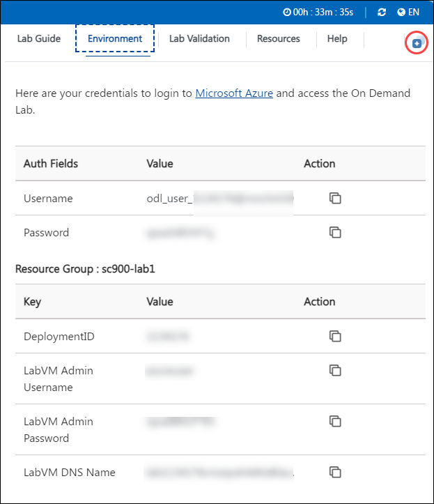

# Analytics in Microsoft Intelligent Data Platform (MIDP)

### Overall Estimated Duration : **45 Minutes**

## Overview

Microsoft Purview is a unified data governance service that helps organizations manage and govern their data across multi-cloud environments. In this lab, you will explore how Microsoft Purview enables effective data governance for Wide World Importers by managing data from various sources like Azure SQL Database, Oracle, and ADLS Gen2.

In this hands-on lab, you will navigate through the Microsoft Purview portal, explore the data map to visualize and govern the data assets across the estate, and review the relationships between different data sources. This exercise emphasizes the importance of data governance, ensuring that all data is classified, discovered, and made accessible for users across the organization, empowering data-driven insights and ensuring compliance and security.

## Objective

**Glimpse of Purview to govern the overall data and analytics estate:** Learn to explore and manage data governance across multi-cloud environments using Microsoft Purview. Gain hands-on experience in navigating the Purview Governance Portal, discovering and classifying data from various sources and understanding how data relationships are mapped. Additionally, explore how to organize and manage data sources within the data map, ensuring that they are easily discoverable and accessible for governance. This process will help develop the skills necessary to manage and govern data assets, ensuring compliance, security, and accessibility across your data estate. 

## Prerequisites

Participants should have:

- **Understanding of Data Governance**: Knowledge of the importance of data governance and the ability to classify and manage data assets across multiple environments.
- **Familiarity with Microsoft Purview**: A basic understanding of Microsoft Purview, including its role in managing data governance and data cataloging within an organization.
- **Understanding of Data Sources and Cloud Environments**: Awareness of common data sources like Azure SQL Database, Oracle, and ADLS Gen2, and how they integrate into a data governance platform.
- **Basic Data Mapping Concepts**: Knowledge of how data relationships are visualized and managed within a data map to ensure data is accessible and well-governed across the estate.

## Architecture

The lab architecture involves a well-structured flow where Microsoft Purview serves as the central hub for governing the data estate. The architecture begins with connecting various data sources like Oracle, Teradata, ADLS Gen2, and Azure SQL Database to Microsoft Purview. These data sources are registered in Purview’s data map, which visualizes and organizes the relationships between them. Purview ensures that data is classified, secured, and made discoverable for governance purposes. By using the data map, users can easily access, manage, and govern data from disparate sources across the organization, facilitating better decision-making and compliance. The integrated flow ensures streamlined data governance, effective management, and enhanced accessibility for stakeholders.

## Architecture Diagram

## Explanation of Components

The architecture for this lab involves the following key components:

- **Microsoft Purview:** A unified data governance platform that enables the discovery, classification, and management of data across multiple environments. It allows you to govern and visualize the relationships between data sources, ensuring data is accessible, secure, and compliant with governance policies.

- **Data Sources (Oracle, Teradata, ADLS Gen2, and Azure SQL Database):** These are the various operational and analytical data sources that are registered within Microsoft Purview. These data sources provide the raw and structured data that is governed and organized for access, analysis, and compliance within the data estate.

## Getting Started with the Lab 

Once you're ready to dive in, your virtual machine and lab guide will be right at your fingertips within your web browser. 

> **Note:** We recommend having strong internet connectivity while performing the lab. Please ensure you are not connected to a VPN, which can slow down the lab-user experience.

>**Note:** Please minimize the PowerShell window when it appears, do not close it, and wait 15 minutes for the process to complete.
## Virtual Machine & Lab Guide

In the integrated environment, the lab VM serves as the designated workspace, while the lab guide is accessible on the right side of the screen.

**Note**: Kindly ensure that you are following the instructions carefully to ensure the lab runs smoothly and provides an optimal user experience.

## Exploring Your Lab Resources

To receive lab environment details, select the **Environment Details** tab. Additionally, the credentials will be sent to the email address you provided at registration.

   **Note:** If you see the pop-up **experience.cloudlabs.ai would like to access the Clipboard to copy text**, please click on **Allow**.

   
## Utilizing the Split Window Feature
 
For convenience, you can open the lab guide in a separate window by selecting the **Split Window** button from the Top right corner.
 
 

## Lab Guide Zoom In/Zoom Out
 
To adjust the zoom level for the environment page, click the **A↕ : 100%** icon located next to the timer in the lab environment. 

  

## Managing Your Virtual Machine

Feel free to start, stop, or restart your virtual machine as needed from the **Resources** tab. Your experience is in your hands!

  
  
## Let's Get Started with Azure Portal

1. On your virtual machine, click on the Azure Portal icon as shown below:

   
   
1. You'll see the **Sign into Microsoft Azure** tab. Here, enter your credentials:
 
   - **Email/Username:** <inject key="AzureAdUserEmail"></inject>
 
       
 
1. Next, provide your password:
 
   - **Password:** <inject key="AzureAdUserPassword"></inject>
 
       

1. If you see the pop-up **Action Required**, keep default and then click on **Ask later**. If you see the pop-up **Help us protect your account**, click on **Skip for now(14 days until this is required)**, and then click on **Next**.

   >**Note:** You may see this pop-up multiple times, please proceed to **Skip**.

   
 
1. If prompted to stay signed in, you can click "No."

1. If you see the pop-up **Sign in to sync data**, Click on **No,thanks.** 

1. If you see the pop-up **You have free Azure Advisor recommendations!**, close the window to continue the lab.

1. If a **Welcome to Microsoft Azure** popup window appears, click **Cancel** to skip the tour.

1. In the Azure portal, type **Resource groups (1)** in the search box and select **Resource groups (2)** from the results.

    

13. On the **Resource groups** page, select **analyticsSolution**.

    

## Support Contact
 
The CloudLabs support team is available 24/7, 365 days a year, via email and live chat to ensure seamless assistance at any time. We offer dedicated support channels tailored specifically for both learners and instructors, ensuring that all your needs are promptly and efficiently addressed.

Learner Support Contacts:
- Email Support: cloudlabs-support@spektrasystems.com
- Live Chat Support: https://cloudlabs.ai/labs-support

Now, click on **Next** from the lower right corner to move on to the next page. 

### Happy Learning!!
